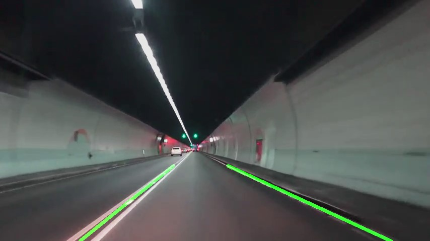

# Lane Detection

Using OpenCV to detect lanes.

## Results

###### Canny

Responsible for taking the input frame and applying these filters:

1. Turning the image to gray
2. Reduce the noise in the image using Gaussian blur

###### Segment

Forms a triangular mask for the valid lane area.

###### Hough Transformation

The goal is to identify two straight lines (left + right).

###### Output

## Resources

["Tutorial: Build a lane detector"](https://towardsdatascience.com/tutorial-build-a-lane-detector-679fd8953132) by Chuan-en Lin.
